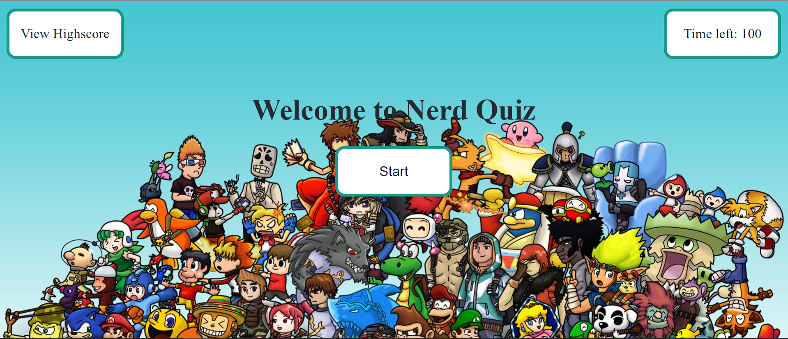
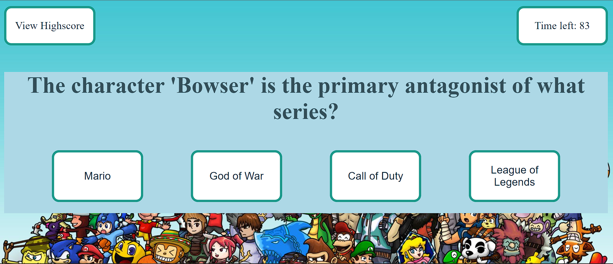
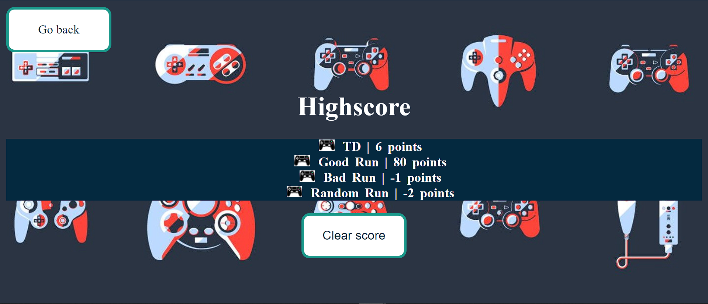

# CodeQuiz
This is a quiz for nerds. All the questions are gaming related.

## Description

- I want to create a quiz game webapp that have questions about gaming
- This project helps me better understand local storage, event listeners, DOM manipulations


## Table of Contents 
- [Usage](#usage)
- [Links](#links)
- [Features](#features)
- [User Story](#user-story)
- [Acceptance Criteria](#acceptance-criteria)


## Usage








## Links

- Github page: https://github.com/teddysm/CodeQuiz
- Deployed page: https://teddysm.github.io/CodeQuiz/


## Features

- On the main page, user can start the game by clicking the start button, check the current scoreboard by clicking on the highscore button.
- Once the quiz begins, the game cycles through a list of 12 questions, user can choose from 4 options
- Clicking on the wrong answer will flash the screen red, right answer will flash green
- The game ends when user runs out of time or completes all 12 questions
- User can submit their initials to be saved to the Scoreboard (local storage)
- Upon hitting submit, user will be directed to the HighScore page


## User Story

```
AS A coding boot camp student
I WANT to take a timed quiz on JavaScript fundamentals that stores high scores
SO THAT I can gauge my progress compared to my peers
```

## Acceptance Criteria

```
GIVEN I am taking a code quiz
WHEN I click the start button
THEN a timer starts and I am presented with a question
WHEN I answer a question
THEN I am presented with another question
WHEN I answer a question incorrectly
THEN time is subtracted from the clock
WHEN all questions are answered or the timer reaches 0
THEN the game is over
WHEN the game is over
THEN I can save my initials and my score
```
